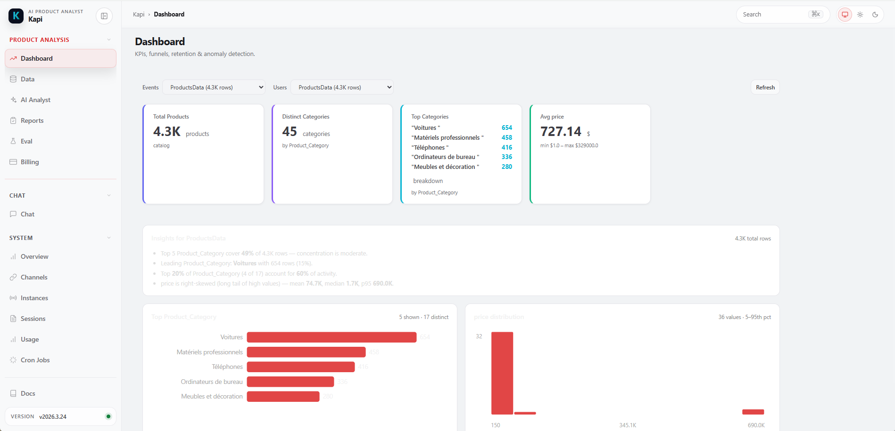
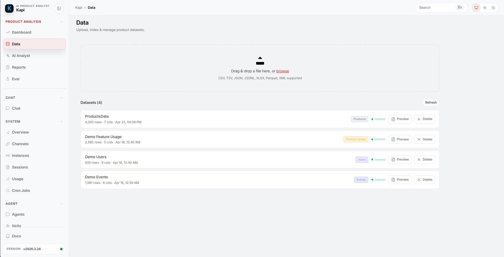
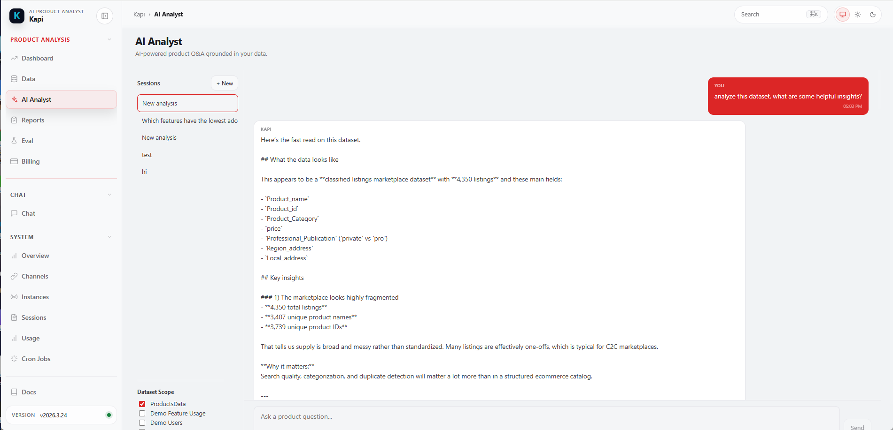
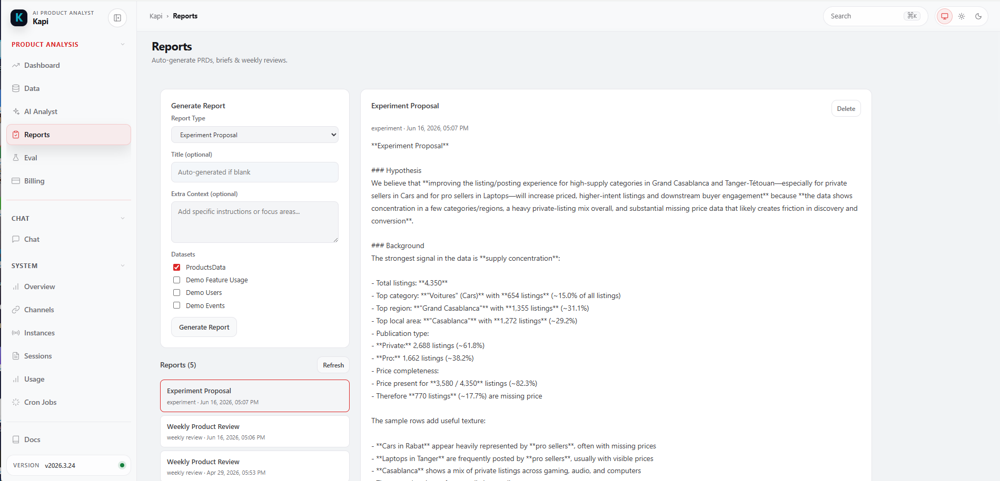
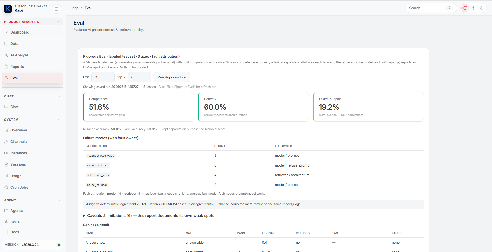

<h1 align="center">Kapi — Local-First AI Product Analyst</h1>

<p align="center">
  RAG-grounded Q&A over your own product data · KPI dashboards · automated PM reports ·
  a rigorous evaluation module · all running locally on your machine.
</p>

---

## What is Kapi?

**Kapi is a local-first AI product-analytics agent.** You drop in a CSV/JSON/XLSX of
product events, users, or transactions, and Kapi gives you grounded Q&A (with citations
back to the rows it used), KPI dashboards, funnel / retention / anomaly analysis, and
one-click PM reports — with everything running on your own machine and only the LLM call
going out to the provider you choose.

Kapi is built on **[OpenClaw](https://github.com/kapi/kapi)**, the open-source AI agent
framework by **Peter Steinberger** (MIT-licensed, distributed as the `kapi` npm package).
OpenClaw provides the local **gateway, agent, skills, and memory**; **this repository adds
a product-analysis & evaluation module** (a FastAPI + RAG backend) and a **Windows
desktop launcher** on top of it. See [Built on OpenClaw](#built-on-openclaw--license).

> **This repo contains:** the `analytics-backend/` (the product-analysis + RAG + eval
> module — the part this project adds) and a `launcher/` (the Windows installer that pulls
> the OpenClaw `kapi` gateway from npm and wires everything into a one-click desktop app).

---

## Key features

- **RAG-grounded Q&A** — ask questions in plain English; answers cite the rows they came
  from and flag low-groundedness responses, so the model can't hallucinate numbers your
  data doesn't support.
- **KPI dashboards** — MAU/DAU, events-per-user, top events, plus shape-aware KPIs for
  products / transactions / users datasets (not just event data).
- **Funnel, retention & anomaly analysis** — conversion funnels, cohort retention, and
  z-score anomaly detection over your uploaded data.
- **Automated PM reports** — one click for a PRD opportunity summary, weekly review, exec
  brief, experiment proposal, or feature-recommendation memo.
- **Multi-provider LLM** — OpenAI (Codex OAuth or API key), Anthropic, Gemini, Mistral,
  xAI, DeepSeek, or local Ollama — your choice.
- **Rigorous evaluation module** — a 51-case labeled test set (answerable / unanswerable /
  adversarial) with ground truth computed from the data, scored on **three separate axes**
  (lexical support · answer correctness · refusal accuracy), **failure-mode tagging with
  retriever-vs-model fault attribution**, an **LLM-as-judge** grounded by the computed gold
  with **Cohen's κ calibration**, and **A/B comparison** across providers / retrieval
  settings. See [Running the evaluation](#running-the-evaluation).

---

## Screenshots

Kapi runs as a local desktop app with five product-analysis views.

### Dashboard — KPIs, insights & charts
Auto-generated insights (concentration, Pareto, skew), a top-categories bar chart, and a numeric-distribution histogram, computed locally over the selected dataset.



### Data — upload & index datasets
Drag-and-drop upload and indexing for CSV / TSV / JSON / JSONL / XLSX / Parquet / XML, with automatic dataset-type detection (events, users, products, transactions, …).



### AI Analyst — RAG-grounded Q&A
Ask questions in plain English and get answers grounded in your data, with low-groundedness flagging.



### Reports — auto-generated PM deliverables
One-click PRD opportunity summary, weekly review, executive brief, experiment proposal, or feature-recommendation memo, generated from your data.



### Eval — three axes, failure modes & judge κ
A 51-case labeled test set scored on three separate axes (lexical support · answer correctness · refusal accuracy), failure-mode tagging with retriever-vs-model fault attribution, and an LLM-as-judge with Cohen's κ calibration.



---

## Installation & quickstart (Windows)

### Prerequisites
- **Windows 10/11**
- **Node.js 18+** (for the OpenClaw `kapi` gateway)
- **Python 3.10+** (for the analytics backend)
- **Google Chrome** (the desktop app uses Chrome `--app` mode)

### Option A — one-click desktop launcher (recommended)

```powershell
git clone https://github.com/pz0227/kapi.git
cd kapi\launcher
powershell -ExecutionPolicy Bypass -File install.ps1
```

The installer checks prerequisites, runs `npm install -g kapi` (the OpenClaw gateway +
dashboard frontend), installs the Python analytics-backend dependencies, applies the
product-analysis + eval module, and creates a **`Kapi_Test`** icon on your desktop.
Double-click it to launch the full desktop app (Dashboard, Data upload, AI Analyst,
Reports, Eval).

> First launch can take ~2 minutes (cold start). Logs: `%LOCALAPPDATA%\KapiTest\launcher.log`.

### Option B — manual / dev setup (run the backend directly)

Use this to read, hack on, or run the analytics backend + eval without the desktop wrapper.

```powershell
# 1. Gateway (provides the LLM + the dashboard frontend)
npm install -g kapi
kapi daemon start                 # starts the gateway on http://127.0.0.1:18789

# 2. Analytics backend (this repo)
cd kapi\analytics-backend
python -m pip install -r requirements.txt
copy ..\.env.example .env         # optional: add an API key, or configure in-app
python main.py                    # FastAPI on http://127.0.0.1:18792
```

Then open the dashboard URL printed by `kapi dashboard`.

### macOS / Linux — manual setup

The desktop launcher is Windows-only for now, but the full stack (gateway + analytics
backend + dashboard) runs anywhere Node and Python do:

```bash
# 1. Gateway
npm install -g kapi
kapi daemon start                  # gateway on http://127.0.0.1:18789

# 2. Analytics backend (this repo)
git clone https://github.com/pz0227/kapi.git
cd kapi/analytics-backend
python3 -m venv .venv && source .venv/bin/activate
pip install -r requirements.txt
cp ../.env.example .env            # optional: add an API key, or configure in-app
python main.py                     # FastAPI on http://127.0.0.1:18792
```

> First AI query normally pays a ~45s model-load cost; the backend pre-warms the
> embedder in the background at startup, so give it ~30s after boot and the first
> query returns warm. Latency is logged per stage — `grep TIMING` the backend logs
> to see where time goes (embed / search / context / first token).

---

## Configuring an LLM provider

Kapi never ships keys. Provide **one** of the following:

1. **In-app / CLI** — run `kapi configure`, or use the dashboard's provider setup. Best for
   OpenAI Codex OAuth (no key to paste): `kapi models auth login --provider openai-codex`.
2. **Environment file** — copy [`.env.example`](.env.example) to `analytics-backend/.env`
   and set one key (`ANTHROPIC_API_KEY`, `OPENAI_API_KEY`, `GEMINI_API_KEY`, …).

> `.env` is gitignored. **Never commit real keys.** Your keys live only on your machine
> (in `analytics-backend/.env` or `~/.kapi/`), never in this repo.

---

## Running the evaluation

The eval runs the labeled test set against the **live retriever + live LLM** and writes a
JSON + Markdown report. From `analytics-backend/` (with the gateway running):

```powershell
# 0. Health check — confirms the LLM is reachable (no "(provider_error)")
python -m services.eval.run_eval --limit 1

# 1. Full run (51 cases) with the LLM-as-judge + Cohen's κ calibration
python -m services.eval.run_eval --judge

# 2. A/B comparison across two retrieval depths
python -m services.eval.run_eval --compare-topk 6,12
```

Reports are written to `analytics-backend/storage/eval_runs/<run_id>/` (gitignored).

### How to read the output
- **Three separate axes** (never blended into one score):
  - **Competence** — % of *answerable* cases answered correctly vs the computed gold.
  - **Honesty** — % of *unanswerable / adversarial* cases correctly declined.
  - **Lexical support** — word-overlap with retrieved chunks; a **secondary** signal, **not**
    correctness (an answer can be lexically supported yet numerically wrong).
- **Failure distribution + fault owner** — each failure is tagged and attributed to the
  **retriever** (e.g. `retrieval_miss` — fix chunking/retrieval) or the **model** (e.g.
  `hallucinated_fact`, `missed_refusal` — fix the prompt/model).
- **Judge κ** — `judge vs deterministic: agreement=… kappa=…`. **Cohen's κ** (chance-corrected)
  tells you how much to trust the same-model judge; κ > ~0.6 is "substantial." Disagreements
  are listed so you can inspect where the judge and the deterministic metrics diverge.

Full methodology, design rationale, and known limitations:
[`METHODOLOGY.md`](analytics-backend/services/eval/METHODOLOGY.md)
· run guide: [`HOW_TO_RUN.md`](analytics-backend/services/eval/HOW_TO_RUN.md)

---

## Project structure

```
kapi/
├─ analytics-backend/        # product-analysis + RAG + eval module (FastAPI, Python)
│  ├─ api/routes/            # data, analytics, chat (AI Analyst), reports, eval, providers
│  ├─ services/
│  │  ├─ rag/                # embedder, FAISS index, retriever, groundedness
│  │  ├─ providers/          # multi-provider LLM router
│  │  └─ eval/               # the evaluation system (test set, metrics, judge, A/B, reports)
│  ├─ data/                  # synthetic demo datasets + the labeled eval test set
│  ├─ models/ · core/        # schemas, DB, config, auth
│  └─ main.py · requirements.txt
└─ launcher/                 # Windows one-click installer + desktop launcher (PowerShell)
   ├─ install.ps1            # npm install -g kapi, deps, apply module, desktop shortcut
   ├─ Kapi_Test.ps1          # the launcher the desktop icon runs
   ├─ apply_patches.ps1      # overlays this module onto the npm `kapi` install
   └─ patches/               # the overlay files (backend + control-ui assets)
```

---

## Built on OpenClaw · License

Kapi is built on **[OpenClaw](https://github.com/kapi/kapi)** — the open-source, MIT-licensed
AI agent framework created by **Peter Steinberger** (distributed as the `kapi` npm package).
OpenClaw provides the local gateway, agent runtime, skills, memory, and multi-channel
integrations. The desktop launcher in this repo installs OpenClaw via `npm install -g kapi`;
it is **not** re-vendored here.

This repository's additions — the `analytics-backend` product-analysis + RAG + evaluation
module and the Windows launcher — are released under the **MIT License**, and the upstream
OpenClaw copyright and license are preserved. See [LICENSE](LICENSE).

- OpenClaw / `kapi` framework — © 2025 Peter Steinberger (MIT)
- Kapi product-analysis & evaluation module + launcher — © 2026 Polly Zheng (MIT)
